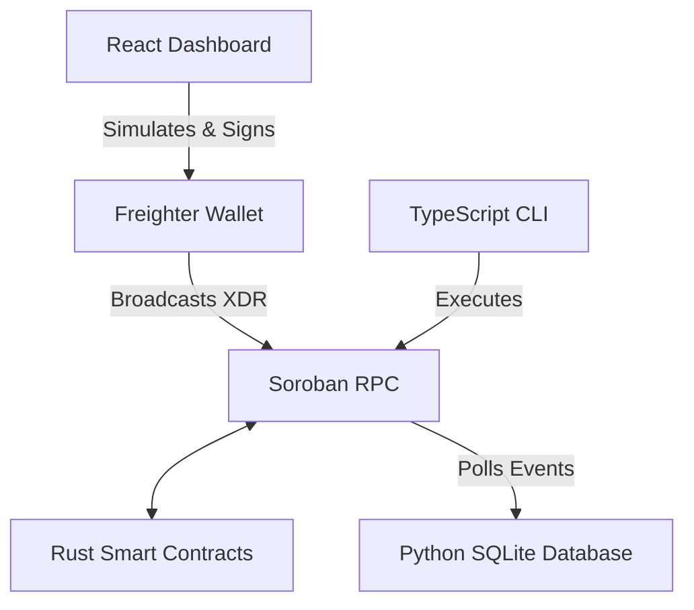

# OrbitStream 🪐

**Live Dashboard:** [orbitstream-bice.vercel.app](https://orbitstream-bice.vercel.app/)
**Testnet Contract ID:** <PASTE_YOUR_ACTUAL_CONTRACT_ID_HERE>

OrbitStream is a continuous funding protocol built on the Stellar network using Soroban. It enables trustless, per-second token streaming between senders and open-source maintainers. 

This repository was developed as a submission for the **Drips Network Wave Program**.

## 🏗️ Architecture



This monorepo contains three interconnected components:
1. **Smart Contracts (`/contracts`)**: Written in `#![no_std]` Rust. Utilizes Soroban's isolated persistent storage for $O(1)$ gas scalability and implements the Checks-Effects-Interactions pattern for secure token withdrawals.
2. **Off-Chain Indexer (`/indexer`)**: An asynchronous Python service (`aiohttp` + `SQLAlchemy`) that parses raw XDR payloads from the Soroban JSON-RPC to track stream state in real-time.
3. **Developer CLI (`/cli`)**: A strictly-typed TypeScript command-line tool featuring dynamically generated WebAssembly bindings and native Stellar SDK integrations for automated allowance management.

### Design Decisions & Tradeoffs: Allowance vs. Escrow
OrbitStream currently utilizes an **allowance-pull model** rather than an escrow vault. Funds remain in the sender's wallet until the receiver calls `claim()`, at which point the contract pulls the accrued tokens via `token_client.transfer`. 
*   **Tradeoff:** If a sender's wallet balance or allowance drops below the accrued amount, the stream will continue to reflect a "phantom balance" on the frontend, and the `claim()` transaction will fail. 
*   **Future Mitigation:** Phase 2 of the protocol will introduce an optional escrow model where senders pre-deposit a locked baseline of tokens upon initialization.
*   **Cancellation Revert Risk:** Because cancellation requires settling the final accrued balance, if a sender's allowance or balance hits zero, the settlement transfer will revert the entire cancel_stream call, leaving the stream stuck open.

### Token Denomination
All `flow_rate` and balance values are strictly denominated in **stroops** (1 unit = 10,000,000 stroops).

### Indexer Event Schema
The Soroban smart contract emits the following events for off-chain indexing:
* `init`: Topics `(symbol!("init"), sender: Address, receiver: Address)` | Data: `flow_rate: u64`
* `claim`: Topics `(symbol!("claim"), sender: Address, receiver: Address)` | Data: `amount_withdrawn: u64`
* `cancel`: Topics `(symbol!("cancel"), sender: Address, receiver: Address)` | Data: `final_payout: u64`

## 🚀 Quick Start (Testnet)

**1. Setup & Deploy**
```bash
make setup    # Generates your local Testnet identity
make deploy   # Compiles WASM and deploys to Testnet
make bindings # Syncs TypeScript interfaces
```

**2. Approve Tokens**
Grant the Stream Contract permission to spend your Testnet assets (e.g., native XLM):
```bash
npm run cli -- approve --token CDLZFC3SYJYDZT7K67VZ75HPJVIEUVNIXF47ZG2FB2RMQQVU2HHGCYSC --amount 100000
```

**3. Initialize a Stream**
```bash
npm run cli -- init --receiver <MAINTAINER_ADDRESS> --token <TOKEN_ADDRESS> --flow-rate 50
```

**4. Check Stream State**
```bash
npm run cli -- get --sender <YOUR_ADDRESS> --receiver <MAINTAINER_ADDRESS>
```

**5. Claim Accrued Tokens (As the Receiver)**
```bash
npm run cli -- claim --sender <SENDER_ADDRESS> --receiver <YOUR_ADDRESS>
```

## 🔒 Security

* **No Global Maps:** Streams are keyed by (Sender, Receiver) tuples in persistent storage, preventing gas limit exhaustion and state collisions.
* **Lazy Evaluation:** Token accrual is calculated deterministically via block timestamps (`env.ledger().timestamp()`), eliminating continuous I/O overhead.
* **Double-Spend Protection:** `claim` mutations are executed prior to cross-contract token transfers.

## Roadmap
> Note: The contracts/split directory contains early WIP logic for a stream-splitting fan-out architecture, slated for future development.
